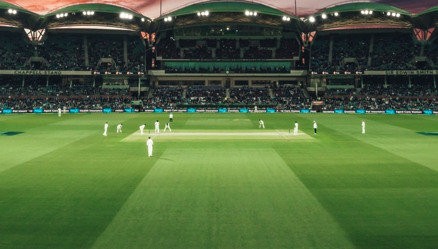

# Homography in Computer Vision

## Examples of overlaying advertisement in cricket field

 
#Add
 
#Voila!!
 

## Exmaple of using homography to correct camera angle of papers
 

## Using opencv

- Future uses can be implementing cam scanner completely
- Converting football ground to top view
